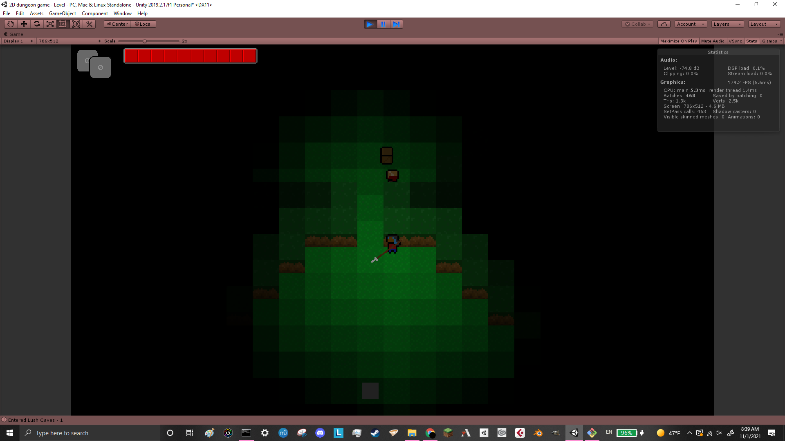
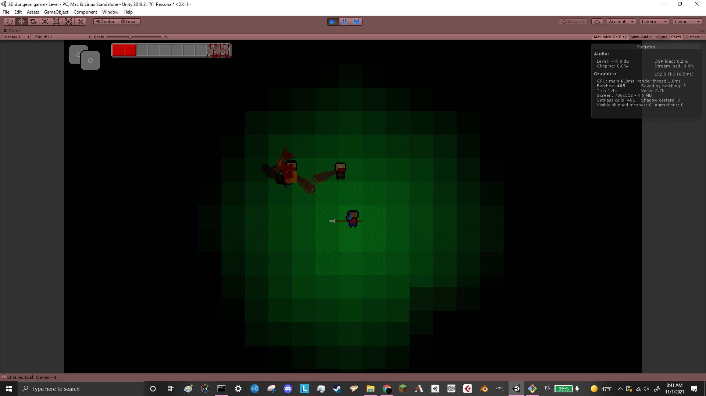

This is a game I made based on Brian Walker's talks on Procedural Generation and Emergent Gameplay. My goal is to create a game with open-ended systemic gameplay, such that a player can use a variety of creative methods to solve any given problem. I hope to eventually create complex emergent gameplay through the interaction of simple systems, including liquids, fire, dynamic lighting, and AI. This game is currently in the very early stages of development, but already demonstrates some of the basic concepts that will be fleshed out later on.

Here are a few screenshots:
The player encounters a nasty gang of bandits

The player hides behind a corner while a bandit waits in abmush. Note the light spilling through the doorway

In an intense battle, the player knocks several bandits into their own campfire, burning them!

Here are Brian Walker's talks:
[Brian Walker - Procedural level design in Brogue and beyond](https://www.youtube.com/watch?v=Uo9-IcHhq_w)
[Proc gen & gameplay - Brian Walker](https://www.youtube.com/watch?v=PdCQ56UxVVE)
